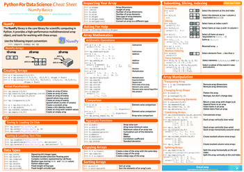
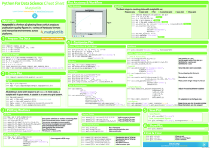

CDS 411 course materials
================

  - [Calendar](#calendar)
  - [Readings](#readings)
  - [Homeworks](#homeworks)
  - [Final project](#final-project)
  - [Resources and links](#resources-and-links)
      - [Datacamp cheat
sheets](#datacamp-cheat-sheets)
      - [Software](#software)
  - [License](#license)

## Topic schedule

| Class | Topic                                                                                                               |
| ----: | :------------------------------------------------------------------------------------------------------------------ |
|     1 | [Course toolbox](class_notes/class01)                                                                               |
|     2 | [Python fundamentals I](class_notes/class02)                                                                        |
|     3 | [Python fundamentals II](class_notes/class03)                                                                       |
|     4 | [Python for scientific computing I](class_notes/class04)                                                            |
|     5 | [Python for scientific computing II](class_notes/class05)                                                           |
|     6 | [Python for scientific computing III](class_notes/class06)                                                          |
|     7 | [System dynamics models: Growth and decay](class_notes/class07)                                                     |
|     8 | [System dynamics models: Growth and decay II](class_notes/class08)                                                  |
|     9 | [System dynamics models: Drug dosage I](class_notes/class09)                                                        |
|    10 | [System dynamics models: Drug dosage II](class_notes/class10)                                                       |
|    11 | [System dynamics models: Damped oscillator and bungee jumping I](class_notes/class11)                               |
|    12 | [System dynamics models: Damped oscillator and bungee jumping II](class_notes/class12)                              |
|    13 | [System dynamics models: Damped oscillator and bungee jumping III and shark competition model](class_notes/class13) |
|    14 | [Data-driven modeling I](class_notes/class14)                                                                       |
|    15 | [Data-driven modeling II](class_notes/class15)                                                                      |
|    16 | [Data-driven modeling III](class_notes/class16)                                                                     |
|    17 | [Data-driven modeling IV](class_notes/class17)                                                                      |
|    18 | [Monte Carlo simulations I](class_notes/class18)                                                                    |
|    19 | [Monte Carlo simulations II](class_notes/class19)                                                                   |
|    20 | [Monte Carlo simulations III](class_notes/class20)                                                                  |
|    21 | [Cellular automata I: Heat diffusion](class_notes/heat_diffusion)                                                   |
|    22 | [Cellular automata II: Forest fire](class_notes/forest_fire)                                                        |
|    23 | [Cellular automata III: Ants](class_notes/ants)                                                                     |
|    24 | [Course wrap-up](class_notes/wrapup)                                                                                |

## Readings

| Week | Book                                                                                                                          | Assignment                                                                                                                                                                                                      |
| ---: | :---------------------------------------------------------------------------------------------------------------------------- | :-------------------------------------------------------------------------------------------------------------------------------------------------------------------------------------------------------------- |
|    1 |                                                                | Read all of chapters 1.1 and 1.2                                                                                                                                                                                |
|    2 |  | **Supplement** Chapters 1 through 8 cover the material in the **Python fundamentals** classes in more depth and with a focus on helping beginners.                                                           |
|    2 |           | **Supplement** Chapters 2, 3, 5, 7, 8, 10, 11, 12, and 14 cover the material in the **Python fundamentals** classes. This book is a reference manual for Python, and covers things at a more advanced level. |
|    3 | [An introduction to Numpy and Scipy by M. Scott Shell](https://engineering.ucsb.edu/~shell/che210d/numpy.pdf)                 | Read from the beginning up until the end of the Statistics section on page 19                                                                                                                                   |
|    4 |                                                                | Read all of chapters 2.2 and 2.3                                                                                                                                                                                |
|    5 |                                                                | Read all of chapter 2.5                                                                                                                                                                                         |
|    6 |                                                                | Read all of chapter 3.2                                                                                                                                                                                         |
|    9 |                                                                | Read all of chapters 8.2 and 8.3                                                                                                                                                                                |
|   10 |                                                                | Read all of chapter 9.2                                                                                                                                                                                         |
|   11 |                                                                | Read all of chapters 9.3 and 9.5                                                                                                                                                                                |
|   12 |                                                                | Read all of chapter 10.2                                                                                                                                                                                        |
|   13 |                                                                | Read all of chapter 10.3                                                                                                                                                                                        |

## Homeworks

| \# | Description                                                                                        |
| -: | :------------------------------------------------------------------------------------------------- |
|  1 | [**Python fundamentals** and **Python for scientific computing** exercises](homework/homework1.md) |
|  2 | [System dynamics: growth and decay models](homework/homework2.md)                                  |
|  3 | [System dynamics: oscillatory motion models](homework/homework3.md)                                |
|  4 | [Data-driven modeling](homework/homework4.md)                                                      |
|  5 | [Monte Carlo simulations: integration and random number generation](homework/homework5.md)         |
|  6 | [Monte Carlo simulations: random walk](homework/homework6.md)                                      |
|  7 | [Cellular automata simulations](homework/homework7.md)                                             |

## Final project

**Instructions:** [project/final\_project.md](project/final_project.md)

## Resources and links

### Datacamp cheat sheets

[Datacamp](https://datacamp.com) has put together a series of [*Python
for Data Science* cheat
sheets](https://www.datacamp.com/community/data-science-cheatsheets)
that you can use as a quick reference during the class. The most
relevant ones have been downloaded to this repository and are linked
below:

| Cheat sheet                                                                                                                                                     | Description                                   |
| :-------------------------------------------------------------------------------------------------------------------------------------------------------------- | :-------------------------------------------- |
|                                | Basics of the Jupyter Notebook                |
|  | NumPy Basics                                  |
|          | SciPy - Linear Algebra                        |
|                | Data visualization with Matplotlib            |
|             | Data visualization with Seaborn               |
|                              | Importing Data                                |
|                       | Data transformation and reshaping with Pandas |
|                                    | Machine learning with Scikit-Learn            |

### Software

The following software is not required for participating in the course,
but may be useful in your
workflow.

<table>

<thead>

<tr>

<th style="text-align:left;">

Software

</th>

<th style="text-align:left;">

OS

</th>

<th style="text-align:left;">

Description

</th>

</tr>

</thead>

<tbody>

<tr>

<td style="text-align:left;">

[GitKraken ](https://www.gitkraken.com/git-client)

</td>

<td style="text-align:left;">

Windows macOS Linux

</td>

<td style="text-align:left;">

A graphical interface for using git. Cross-platform, works with GitHub,
and free to use for educational purposes. Cheatsheets available:

<ul>

<li>

<a href='cheatsheets/gitkraken-cheat-sheet.pdf'>GitKraken cheat
sheet</a>

</li>

<li>

<a href='cheatsheets/gitkraken-for-github-users-cheat-sheet.pdf'>GitKraken
for GitHub users cheat sheet</a>

</li>

</ul>

</td>

</tr>

<tr>

<td style="text-align:left;">

[GitHub Desktop ](https://desktop.github.com)

</td>

<td style="text-align:left;">

Windows macOS

</td>

<td style="text-align:left;">

A graphical interface for interacting with GitHub, built by GitHub. User
documentation from GitHub is
available:

<ul>

<li>

<a href='https://help.github.com/desktop/guides/getting-started-with-github-desktop/'>Getting
Starting with GitHub
Desktop</a>

</li>

<li>

<a href='https://help.github.com/desktop/guides/contributing-to-projects/'>Contributing
to projects with GitHub Desktop</a>

</li>

</ul>

</td>

</tr>

<tr>

<td style="text-align:left;">

[Visual Studio Code ](https://code.visualstudio.com/)

</td>

<td style="text-align:left;">

Windows macOS Linux

</td>

<td style="text-align:left;">

A cross-platform and open-source integrated development environment
(IDE) for programming. Uses a plugin system called Extensions to add
support for different languages and for interfacing with git and GitHub.
At a minimum, you should install the [official extension for
Python](https://marketplace.visualstudio.com/items?itemName=ms-python.python).
There are also [introductory tutorial videos
available](https://code.visualstudio.com/docs/getstarted/introvideos).

</td>

</tr>

<tr>

<td style="text-align:left;">

[PyCharm ](https://jetbrains.com/pycharm)

</td>

<td style="text-align:left;">

Windows macOS Linux

</td>

<td style="text-align:left;">

A cross-platform integrated development environment (IDE) designed
specifically for programming in Python. Comes with many useful features
enabled. Has a plugin ecosystem, but unlike Visual Studio Code they can
be treated as optional. There are [introductory tutorial videos
available](https://www.jetbrains.com/pycharm/documentation/pycharm-videos.html).
As a current student, you get a free professional license for the editor
if you [fill out and submit this
form](https://www.jetbrains.com/shop/eform/students).

</td>

</tr>

</tbody>

</table>

## License

Unless otherwise noted, the course materials in this repository are
licensed under a [Creative Commons Attribution-ShareAlike 4.0
International License](http://creativecommons.org/licenses/by-sa/4.0/).
