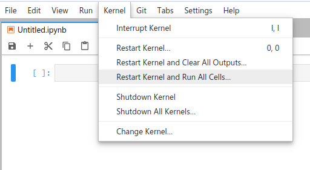
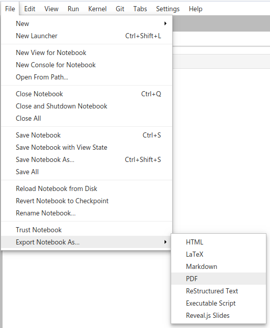

Homework 4
================

## Instructions

Obtain the GitHub repository you will use to complete the homework
assignment, which contains the starter Jupyter notebook file
`homework4.ipynb`. The notebook template provides space for you to
answer each question. Your notebook should run without error when you
select **Restart Kernel and Run All
Cells**:

When you’re done, save your file, then stage, commit, and push (upload)
it to GitHub, and then follow the instructions in the [How to
submit](#how-to-submit) section.

## Questions

1.  Using the `oscillator.py` file included with your starter files,
    generate data for the length (meters) of a damped spring with
    respect to time (seconds). Use the default values when performing
    the simulation. After you’ve collected the simulation data, *sample*
    data from the simulation at larger intervals than the time step
    `delta_t`. Then, discover a polynomial summation model or some other
    function that best fits the sampled simulated data. You should use
    cross-validation to justify the model that you select.

2.  The Average Daily Temperature Archive (University of Dayton 2012)
    has datasets for the average daily temperatures over a period of
    several years for a number of cities in the United States along with
    others around the world. For your convenience, the `dayton.py` file
    included with your starter files provides two functions,
    `download_data()` and `make_temperature_df()`, to help you download
    and import the data. You only need to run `download_data()` once.
    After running `download_data()`, run `make_temperature_data()` in
    your Jupyter notebook to construct a `pandas` data frame containing
    all the available temperature data. **Do not attempt to upload the
    raw data to GitHub\!**
    
    Fit the data for two different cities **in the United States** using
    a sine function. Compare the periods you obtained for the two sine
    functions. Does the result make sense? Explain what the period of
    the sine function means with respect to this dataset. You do not
    need to use cross-validation for this problem.

## How to submit

**To lock in your submission time**, export your notebook to PDF and
upload the PDF file to the assignment posting on
Blackboard.

**In addition, be sure to save, commit, and push your final result so
that everything is synchronized to GitHub.** I may want to inspect your
source files directly and run your notebook, so it’s very important that
the files in your homework repository match what I see in the PDF export
uploaded to Blackboard.
