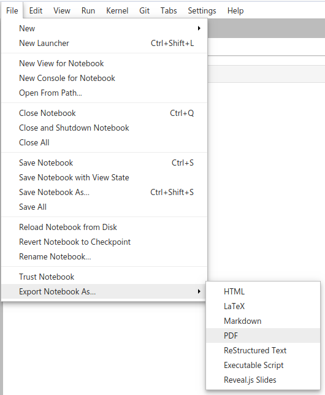

Homework 5
================

## Instructions

Obtain the GitHub repository you will use to complete the homework
assignment, which contains the starter Jupyter notebook file
`homework5.ipynb`. The notebook template provides space for you to
answer each question. Your notebook should run without error when you
select **Restart Kernel and Run All
Cells**:

When you’re done, save your file, then stage, commit, and push (upload)
it to GitHub, and then follow the instructions in the [How to
submit](#how-to-submit) section.

## Questions

### Monte Carlo integration

For questions 1 and 2, do the following:

<table>

<tbody>

<tr>

<td>

**a.** Starting with the Monte Carlo functions demoed in the class 21
notes,
<https://github.com/jkglasbrenner/cds411-course-materials/blob/master/class_notes/class21>,
modify the function so that it can compute the value of the requested
quantity. You should be able to specify the number of darts used in the
computation.

**b.** Run the function defined in Part a 10,000 times, computing the
mean of the results.

**c.** Use resampling to compute the standard error of the mean. Review
the code under the **Activity** header in the class 21 notes for a
refresher.

**d.** Visualize the distribution of values obtained in Part b. Your
figure should also plot a line representing the mean value and the upper
and lower bounds for the standard error of the mean.

</td>

</tr>

</tbody>

</table>

1.  An estimate of . The area of a circle is , where  is the radius. The equation of a circle of radius
     with center at the
    origin is
    . Use a circle of radius 1. Consider the quarter
    of the circle in the first quadrant with  and , and multiply your result by 4.

2.  An estimate of the volume of a sphere of radius 1 whose equation is
    . Consider the portion of the sphere
    with , , and ; and multiply your result by 8. In the case of three
    dimensions, a point has three coordinates "). Notice that Monte Carlo integration is useful for
    dimensions beyond two.

### Random number sampling

For question 3, use the methods discussed in the chapter 9.3 of the
textbook chapter and in the
[class 21](https://github.com/jkglasbrenner/cds411-course-materials/blob/master/class_notes/class21)
and
[class 22](https://github.com/jkglasbrenner/cds411-course-materials/blob/master/class_notes/class22)
lecture notes.

3.  This question develops code for the rejection method with the
    probability density function =2\\pi\\sin(4\\pi x)").
    
    1.  Define a Python function to represent the formula
        =2\\pi\\sin(4\\pi x)"). For an example, see
        `cubic_function` defined in the `mc_integration.py` file:
        <https://github.com/jkglasbrenner/cds411-course-materials/blob/master/class_notes/class21/mc_integration.py>
    
    2.  Plot ") from 0.0 to 2.5, see Figure 9.3.12 in the textbook.
    
    3.  Assign to variable `rand` a uniform number from 0.0 to 0.25, the
        interval of interest in Figure 9.3.12.
    
    4.  Define a Python function called `rejection_method()` with no
        arguments that will return a random number using the rejection
        method. The algorithm for the rejection method is as follows:
        
          - If
            ") is greater than a uniform random number
            from 0 to
            =2\\pi\\sin(\\pi/2)=2\\pi"), which is
            the maximum value of
            "), return `rand`.
        
          - If the condition is false, we reject `rand` and search for
            another candidate.
        
        Implement this algorithm using a `while` loop in Python, such
        that you exit the loop only after a candidate that passes the
        test is found.
    
    5.  Use the function you built in the previous step to generate a
        list of 1000 random numbers from 0.0 to 0.25 sampled from the
        probability density function =2\\pi\\sin(4\\pi x)") using the rejection method.
    
    6.  Display a histogram of these values.

## How to submit

**To lock in your submission time**, export your notebook to PDF and
upload the PDF file to the assignment posting on
Blackboard.

**In addition, be sure to save, commit, and push your final result so
that everything is synchronized to GitHub.** I may want to inspect your
source files directly and run your notebook, so it’s very important that
the files in your homework repository match what I see in the PDF export
uploaded to Blackboard.
