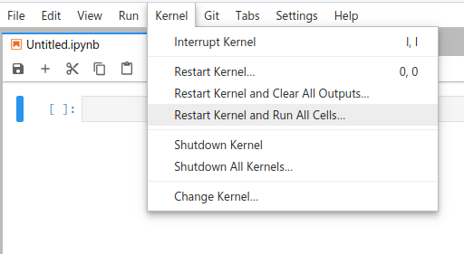

Homework 6
================

## Instructions

Obtain the GitHub repository you will use to complete the homework
assignment, which contains the starter Jupyter notebook file
`homework6.ipynb`. The notebook template provides space for you to
answer each question. Your notebook should run without error when you
select **Restart Kernel and Run All
Cells**:

When you’re done, save your file, then stage, commit, and push (upload)
it to GitHub, and then follow the instructions in the [How to
submit](#how-to-submit) section.

## Questions

1.  Starting from the random walk code in the class 22 Jupyter notebook
    in the `course_materials` repo on Github,
    <https://github.com/jkglasbrenner/cds411-course-materials/blob/master/class_notes/class22/class22_notebook.ipynb>,
    revise the code so that the random walker can take steps along the
    north, east, south, or west directions with probabilities of 20%,
    30%, 45%, or 5%, respectively. You may do this using either the
    pseudocode-based version of the code or the `numpy` version of the
    code.
    
    **Hint:** You’re not just changing probabilities, you also have to
    change the step directions from northwest, northeast, southeast, and
    southwest to north, east, south, and west.

2.  Starting from the random walk code in the class 22 Jupyter notebook
    in the `course_materials` repo on Github,
    <https://github.com/jkglasbrenner/cds411-course-materials/blob/master/class_notes/class22/class22_notebook.ipynb>,
    develop a function that:
    
    1.  Uses the distance formula to compute the distance traveled
        during a single random walk of `nsteps`.
    
    2.  Computes the average distance traveled for any given value of
        `nsteps` by running the random walk simulation 1000 times,
        computing the distance traveled during each run, and then
        averaging the results.
    
    3.  Using the above routine, computes the average distances covered
        for random walks of step sizes from 1 to 50 (you will end up
        with 50 data points).
    
    4.  Plots the average distance traveled as a function of `nsteps`,
        reproducing Figure 9.5.3 in the textbook.
    
    You may do this using either the pseudocode-based version of the
    code or the `numpy` version of the code.

## How to submit

**To lock in your submission time**, export your notebook to PDF and
upload the PDF file to the assignment posting on
Blackboard.

**In addition, be sure to save, commit, and push your final result so
that everything is synchronized to GitHub.** I may want to inspect your
source files directly and run your notebook, so it’s very important that
the files in your homework repository match what I see in the PDF export
uploaded to Blackboard.
